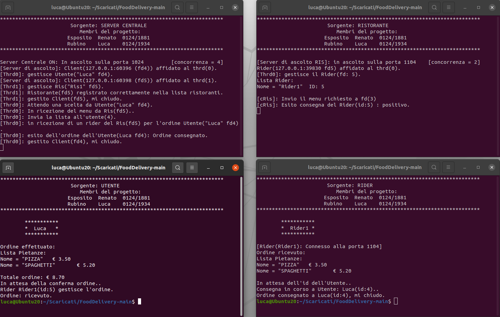

<h1> FoodDelivery Project </h1>
FoodDelivery is a simulation of a networked food delivery service conceived by <b>Renato Esposito</b> and <b>Luca Rubino</b>. 
 It is a project of <a href="https://www.uniparthenope.it/ugov/degreecourse/43355"><i><b>Computer Networks</i></b></a> (course of the <b><i><a href="https://www.uniparthenope.it/">Parthenope University of Naples</a></i></strong>). This project was implemented in February 2021.

<h3> There are an output example </h3>

